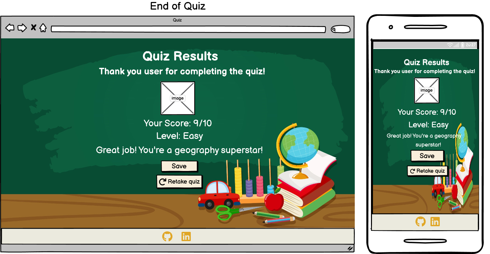
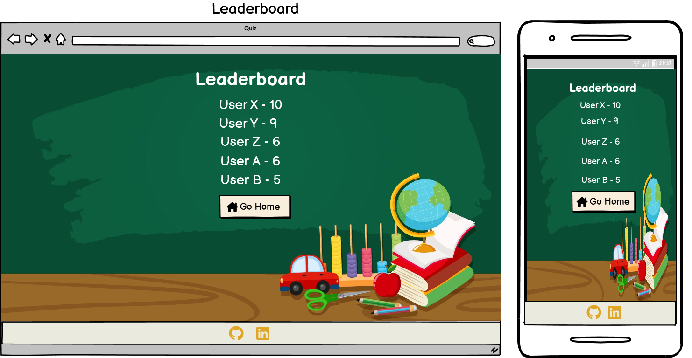
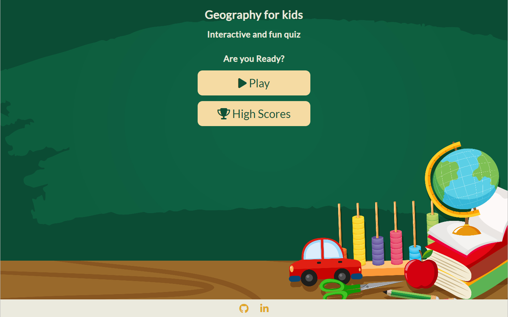
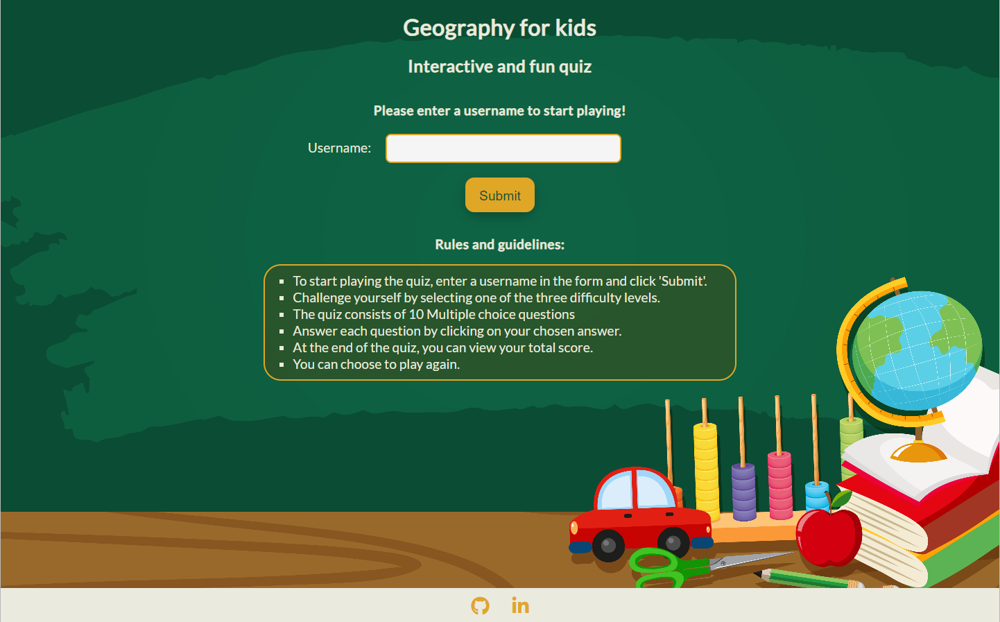

# Geography for Kids
(Developer: Deeksha Varma)

You can view the live site here - <a href="https://deeksha-varma.github.io/portfolio_project_2/" target="_blank" rel="noopener">Geography quiz for Kids</a>

## Table of Contents
1. [Introduction](#introduction)
2. [Project Goals](#project-goals)
    1. [User Goals](#user-goals)
    2. [Site Owner Goals](#site-owner-goals)
3. [User Experience](#user-experience)
    1.  [Strategy](#strategy)
        * [Target Audience](#target-audience)
        * [User Requirements & Expectations](#user-requirements-and-expectations)
        * [User Stories](#user-stories)
    2. [Scope](#scope)
        * [Initial Stage](#intial-stage)
        * [Future Additions](#future-additions)
    3. [Structure](#structure)
        * [Wireframes](#wireframes)
    4. [Skeleton](#skeleton)
    5. [Surface](#surface)
        * [Color Scheme](#color-scheme)
        * [Font](#font)
    6. [Features](#features)
4. [Technologies Used](#technologies-used)
    1. [Language](#languages)
    2. [Frameworks & Tools](#frameworks--tools)
5. [Testing and Validation](#testing-and-validation)
    1. [HTML](#html-validation)
    2. [CSS](#css-validation)
    3. [JavaScript](#javascript-validation)
    3. [Accessibility & Performance](#accessibility--performance)
    4. [Browser Compatibility](#browser-compatability)
    5. [Manual Testing](#manual-testing)
6. [Bugs](#bugs-fixes-and-outstanding-issues)
7. [Deployment & Development](#deployment--development)
8. [Credits](#credits)

## Introduction
Welcome to the Geography Quiz for Kids! This interactive website is designed to provide an engaging and educational experience for young learners, helping them explore the fascinating world of geography while having fun. The quiz consists of 10 multiple choice questions on world geography. The player can choose between several levels of difficulty. The player gets feedback on the number of questions and a score card is shown to let the player know the number of correct and incorrect answers. The quiz consists of randomly generated questions and answers. There is also form validation for the username form. In order to prevent malpractice, the radio button options in the quiz are disabled/greyed out so that the user cannot change their answer once selected. The website is fully responsive and also includes a 404 page. Other quiz elements such as Question counter, Progress bar styling, motivational messages to the user depending on how much they scored in the quiz is also included. A leaderboard section is also included to display the top 5 quiz scores.

## Project Goals

### User Goals

As a user of the Geography Quiz for Kids website, the primary goals are:

* **Educational Engagement:** An interactive and educational experience for kids, helping them learn about geography in an engaging and enjoyable manner.

* **Customizable Difficulty:** Aim to cater to children of different ages and skill levels by offering multiple difficulty levels. This allows each child to find an appropriate challenge and progress at their own pace.

* **Comprehensive Geography Coverage:** The quiz provides a comprehensive overview of global geography and helps kids develop a deeper understanding of the world.

* **User-Friendly Interface:** Aim to create a user-friendly website interface that is intuitive and easy for kids to navigate. Clear instructions, appealing visuals, and a seamless user experience are essential to keeping children engaged and motivated throughout the quiz.

* **Score Tracking and Progress Monitoring:** Incorporate a scoring system that allows kids to track their progress and see their performance. Providing a detailed score report at the end of each quiz encourages improvement and motivates kids to achieve better results.

### Site Owner Goals

As the owner of the Geography Quiz for Kids website, the goals are:

* **Educational Impact:** Aim to provide a valuable educational resource for children, helping them develop their knowledge and understanding of geography in a fun and interactive way.

* **User Engagement:** Create a website that captures and maintains the attention of young users.

* **Positive User Experience:** user-friendly, intuitive, and easy to navigate for both children and their parents or educators.

* **Expansion and Growth:** While starting with a solid foundation, the aim is to expand the website's content and features over time. This may involve adding new quiz categories, incorporating additional learning resources, or integrating social features to encourage collaboration and competition among users.

## User Experience

### Strategy

#### Target Audience

* **Children:** The primary target audience is children between the ages of 6 and 12, who are interested in exploring and learning about geography.
* **Parents:** The website aims to provide parents with a trustworthy and valuable tool to supplement their child's geography learning.
* **Educators**
* **Home-schooling Parents**

#### User Requirements and Expectations

* **Engaging and Interactive:** Users expect the quiz to be engaging and interactive, with visually appealing elements, such as images and illustrations, that capture children's attention and make the learning experience enjoyable.

* **Age-Appropriate Content:** The quiz questions and difficulty levels should be suitable for different age groups within the target audience. Younger children may require simpler questions, while older children may seek more challenging content.

* **Clear Instructions and User-Friendly Interface:** Users expect clear and concise instructions that guide them through the quiz. The website's interface should be intuitive and easy for children to navigate, ensuring they can interact with the quiz without confusion or frustration.

* **Comprehensive Geography Coverage:** The quiz should cover a wide range of geography topics, including continents, countries, capitals, landmarks, and other relevant information. Users expect the quiz to provide a comprehensive overview of global geography.

* **Customizable Difficulty Levels:** Users should have the option to select difficulty levels that match their knowledge and skills. This allows for personalized learning experiences and ensures appropriate challenges for each user.

* **Score Tracking and Progress Monitoring:** Users expect a scoring system that tracks their performance and provides immediate feedback on correct and incorrect answers. They also anticipate a comprehensive score report at the end of each quiz, allowing them to monitor their progress and identify areas for improvement.

* **Compatibility and Accessibility:** Users expect the website to be compatible with different devices (desktop, laptop, tablet, and mobile) and various web browsers. Additionally, ensuring accessibility features, such as keyboard navigation and support for screen readers, is important for users with disabilities.

#### User Stories

##### First-time User
As a first time user, I want to ...
1. ... easily navigate through the quiz.
2. ... clear descriptions or labels for each difficulty level, helping me make the right choice for my knowledge and skill level.
3. ... answer the questions presented to me.
4. ... receive immediate feedback on whether my response was correct or incorrect. Clear indications, such as green checkmarks for correct answers and red crosses for incorrect ones, would be helpful.
5. ... see a visual indicator or progress bar showing how many questions I've answered and how many are left. At the end of the quiz, I expect a comprehensive score report that highlights my performance.
6. ... expect a user-friendly interface with intuitive buttons or navigation elements.
7. ... want to feel a sense of accomplishment. Celebratory messages or animations, along with an overall score or ranking, would be motivating. I expect an option to restart the quiz.
8. ... see a High Scores page to see the top scores.

##### Returning Users
As a returning user, I want to ...
1. ... challenge myself by selecting higher difficulty levels.
2. ... see my previous scores stored in a personalized profile or dashboard.
3. ... find directions to the location of the business.

##### Site owner
As the site owner, I want users to ...
1. ... have a positive user experience.

### Scope

#### Intial Stage

At the initial stage the site will include a welcome section that displays two buttons. 'Play' button to start playing the quiz and a 'HighScores' button to view the Leaderboard. The username for page displays the rules of the game and lets the user input a username, then the user is given a choice of four levels of difficulty of the game. Finally the game will start and run though 10 questions at the chosen level. An end of game page will then load, here the user can opt to play the game again or save their score.

1. **Welcome section:**
    'Play' button - presents the user with a form to continue playing the game.
    'High Scores' button - presents the user with a 'Leaderboard'.
2. **Username form & Rules of the quiz:**
    A user input field that lets the user input their name. Displays the rules of the game.
3. **Choose difficulty level section:**
    This section will provide the user the option to choose from three difficulty levels - Easy, Medium, Hard.
4. **Quiz section:**
    The user is presented with the quiz questions. The question is of the multiple choice format at the chosen difficulty level. The answers are displayed as radio buttons.
5. **End of quiz page:**
    The user is presented with their score and a congratulatory message and an image for successfully completing the quiz. The user can also choose to play again or save score.
6. **Leaderboard/High Scores page:**
    The user can see the top 5 scores of the quiz.

#### Future Additions
In future expansion the site could include
- Timer on each question.
- Audio effects when navigating the quiz
- Displaying the right answer to the user using colors. (ex. green background for the correct answer, red background for the incorrect answer)

### Structure

#### Wireframes

The structure of the site which houses the game controls are incorporated into the index.html page:

1. **Welcome/Home Section** displays the main control buttons of the game. 'Play' button and 'High Scores' button to view the leaderboard.

The username form section, difficulty level section & main quiz section are incorporated into the game.html page:

2. **Username form section & Rules** displays the rules of the game and asks the user to input a username in order to proceed playing the game.

3. **Choose difficulty level Section** that provides users 3 difficulty levels (Easy, Medium & Hard) to choose from.

4. **Quiz Section** is the main game area where the user is presented with 10 questions to answer based on the chosen level of difficulty. A score area below the quiz answer choices keeps track of the score. A progress bar is displayed above the question that helps keep track of the questions left. A question counter is also shown to let the user know the question number they are currently solving. Once the user selects the answer choice, the other choices are disabled/greyed out. The user is prompted with an action button - "Next" to move onto the next question.

The quiz results are displayed on end_quiz.html page:

5. **Quiz Result Page** where the user's performance is denoted with the total score achieved and level at which the game was played with a celebratory message and an image based on score. The user can choose to play the game again by clicking on the 'Retake quiz' button. The user can also to choose to save their score by clicking on 'Save' button.

The leaderboard section is incorporated into highscores.html page

6. **Leaderboard/High Scores Page** displays the top 5 high scores of the quiz.

7. **404 Page** - When user attempts to find a resource that doesn't exist, then the 404.html page is displayed to the user with an appropriate image and a button to start the quiz.

### Skeleton

As described in the previous section with the aid of wireframes, this quiz game website includes 4 interactive sections, which all have a heading, a central display area and a footer. The home page/welcome page has two buttons namely 'Play' button to proceed to username form section and a 'High Scores' button that takes the user to leaderboard page. The Username form page has a username input field which is required to play the game. Upon entering the username, the user has to choose the level at which they would like to play the game, upon selecting the level, the game loads and runs, incrementing the correct or incorrect answer count as the answers are chosen. The end of the quiz page displays final score to the user and a message to user depending on score achieved. There are two buttons on this final page - a 'Save' button that allows the user to save their score and a 'Go Home' button that takes the user back to home page.

### Surface

Since the website is aimed for the kids, the chosen theme aims to convey a classroom and fun feel. The background chosen is a green chalkboard classroom image that allows ease of readability with a good contrast ratio.

#### Color Scheme

1. **Primary Background Color: #0F5136 (Dark Green)**

    This dark green color is reminiscent of lush landscapes and vegetation. It aligns with the geography theme, evoking images of forests and nature. The deep green also complements the classroom feel by recalling the green chalkboards often seen in educational settings.

2. **Text Color for Headers: #EBEADE (Light Gray)**

    Light gray provides a neutral and balanced background that enhances readability and prevents visual fatigue. It complements the other vibrant colors and maintains a clean and organized appearance for text and content.

3. **Text Color for content: #EBEADE (Light Gray) and #482307 (Dark Brown)**

    Dark brown brings a sense of earthiness and stability to the color palette. It has been used for highlighting text inside buttons, providing a grounded and authoritative presence amidst the other lively colors.

4. **Interactive Elements (Buttons, Links): #E0A626 (Golden Yellow)**

    Golden yellow is warm and inviting, adding a touch of positivity and excitement to the color scheme. It has been used for interactive elements like buttons and links in footer, encouraging engagement and interaction with the app.

5. **Feedback Indicators (Correct, Incorrect): #0BDF24 (Vibrant Green) and #F60000 (Bright Red)**

    This vibrant green is reminiscent of fresh growth and vibrancy. It has been used to indicate correct answers, providing a positive and affirming visual cue for users when they answer questions correctly.
    Bright red is attention-grabbing and is often associated with warnings or alerts. In the context of a quiz app, this color has been used to highlight incorrect answers, drawing immediate attention to responses.

By using these colors strategically, I've created a color scheme that combines natural, vibrant, and engaging hues. The dark green and brown evoke a classroom and geographical feel, while the bright red and vibrant green provide clear feedback on user responses. Light gray and golden yellow contribute to readability, positivity, and interactivity. Overall, this color palette aligns well with my goal of conveying a classroom and fun atmosphere for young learners.

#### Font

Lato is the font used. It is a versatile and modern font that can be a suitable choice for Geography Quiz app targeting kids. While Lato might not have the whimsical, playful appearance of fonts specifically designed for kids, its readability and adaptability make it a reasonable choice for an educational app like a Geography Quiz. It presents a balance between professionalism, clarity, and a neutral style that can resonate well with a diverse audience, including young learners.

## Features

### Home Page

Screenshot of Home page on Desktop

Screenshot of Home page on mobile

- Features two buttons. User can click the 'Play' button to get started or click 'High Scores' to view the Leaderboard section.

### Username form section & Rules

Screenshot of form section on Desktop

Screenshot of form section on mobile

- Features a user input field that lets the user input their name. The form has validations for the username field. The rules of the game are displayed in a box below the form.

### Choose difficulty level section

Screenshot of difficulty levels on Desktop

Screenshot of difficulty levels on mobile

- Features 3 difficulty levels (Easy, Medium & Hard) to choose from.

### Quiz section

Screenshot of Quiz Section on Desktop

Screenshot of Quiz Section on mobile

- Features 10 questions to answer based on the chosen level of difficulty. A score area below the quiz answer choices keeps track of the score. A progress bar is displayed above the question that helps keep track of the questions left. A question counter is also shown to let the user know the question number they are currently solving. Once the user selects the answer choice, the other choices are disabled/greyed out. The user is prompted with an action button - "Next" to move onto the next question.

### End of Quiz page

Screenshot of End Quiz page on Desktop

Screenshot of End Quiz page on mobile

- Features user's performance with the total score achieved and level at which the game was played with a celebratory message and an image based on score. The user can choose to play the game again by clicking on the 'Retake quiz' button. The user can also to choose to save their score by clicking on 'Save' button.

### Leaderboard

Screenshot of Leaderboard on Desktop

Screenshot of Leaderboard on mobile

- displays the top 5 high scores of the quiz.

### 404 Page

Screenshot of 404 page on Desktop

Screenshot of 404 page on mobile

- displays the top 5 high scores of the quiz.

### Footer

Screenshot of Footer on Desktop

Screenshot of footer on mobile

- Featured on all pages (also the 404 page).
- Includes links to the LinkedIn and GitHub page of the developer.
- All links open in a new window.

### Future Additions

- Timer on each question.
- Audio effects when navigating the quiz
- Displaying the right answer to the user using colors. (ex. green background for the correct answer, red background for the incorrect answer)

## Technologies Used

### Languages
* [HTML5](https://en.wikipedia.org/wiki/HTML) - Provides the content and structure for the website.
* [CSS3](https://en.wikipedia.org/wiki/CSS) - Provides the styling for the website.
* [Javascript](https://en.wikipedia.org/wiki/JavaScript) - Provides interactivity to the website.

### Frameworks & Tools
- [Git](https://git-scm.com/) - Version Control System used to track the project development.
- [Github](https://github.com/) - Used to host and edit the website.
- [Balsamiq](https://balsamiq.com/) - Used to create wireframes.
- [Google Fonts](https://fonts.google.com/) - Used to open source font-families for use in CSS.
- [Font Awesome](https://fontawesome.com/) - Used for adding icons to the website.
- [Coolors](https://coolors.co/contrast-checker/7c8edb-000000) - Color contrast checker of text and background colors.
- [Image Color Picker](https://imagecolorpicker.com/) - useful to pick colors from images.
- [I love Img](https://www.iloveimg.com/resize-image) - helps to resize images.
- [Am I Responsive](https://ui.dev/amiresponsive) - mockup generator that checks for responsiveness across various device screen widths.

## Testing and Validation

### Code Validation

* The website has been thoroughly tested. All the code has been validated via the [W3C HTML Validator](https://validator.w3.org/) and [W3C CSS Validator](https://jigsaw.w3.org/css-validator/). The issues were noted, documented and fixed as shown below.

### HTML Validation

Home Page

Game Page

End of Quiz Page

 

Leaderboard Page

404 Error Page

### CSS Validation

### JavaScript Validation
The linter [JSHint](https://jshint.com/) was used to validate the JavaScript files.

## Accessibility & Performance

### Accessibility Testing

The website was put through [a11y](https://color.a11y.com/Contrast/) to further test the contrast and found no issues.   

### Lighthouse Testing

The website was assessed for the following parameters using [Chrome Dev Tools](https://developer.chrome.com/docs/devtools/) Lighthouse Testing:

* Performance - How the page performs whilst loading.
* Accessibility - Is the site accessible for all users and how can it be improved.
* Best Practices - Site conforms to industry best practices.
* SEO - Search Engine Optimisation. Is the site optimised for search engine result rankings.  

All pages scored high on performance, accessibility and best practices.
The SEO score for Home page, Game page scored a little less and necessary code changes were made and is documented below.

Home Page

Game Page

End of Quiz Page

Leaderboard Page

404 Error Page

### Responsiveness Testing
* The responsive design tests were carried out manually with [Google Chrome DevTools](https://developer.chrome.com/docs/devtools/) and [Responsive Design Checker](https://www.responsivedesignchecker.com/).  

### Browser Compatability

The websites compatability was tested on the following browsers and no issues were found:
* Google Chrome
* Mozilla Firefox
* Microsoft Edge
* Safari

## Manual Testing
* In addition to the above tests, I have performed manual testing using the following use cases tabulated below to make sure everything works as intended.

    1. Welcome section

        | **Feature** | **Action** | **Expected Result** | **Actual Result** |
        |-------------|------------|---------------------|-------------------|
        | Welcome Section | Input a username and submit | The choose a level section displays |  |

    2. Choose A Level Section

        | **Feature** | **Action** | **Expected Result** | **Actual Result** |
        |-------------|------------|---------------------|-------------------|
        | Choose A Level Section | Click on the choosen level | The game starts  |  |

    3. Quiz Section

        | **Feature** | **Action** | **Expected Result** | **Actual Result** |
        |-------------|------------|---------------------|-------------------|
        | Quiz Section | Click through the answers | New questions are continuously displayed |  |

    3. End of Game Page

        | **Feature** | **Action** | **Expected Result** | **Actual Result** |
        |-------------|------------|---------------------|-------------------|
        | End of Game Page | Choose to play again | Welcome page displays |  |

## Bugs, Fixes and Outstanding issues

### HTML Validation

After putting the website through [HTML Validation](https://validator.w3.org/), I was presented with the following errors for the pages (game.html, 404.html):  

Game Page

404 Error Page

### CSS Validation

After running the website through [W3C CSS Validator](https://jigsaw.w3.org/css-validator/), I was presented with the following warnings:  

The css styles were removed and then validated once again with no warnings  

### Lighthouse Testing

After running the website through [Chrome Dev Tools](https://developer.chrome.com/docs/devtools/) Lighthouse Testing, I was presented with the following SEO score for index page:  

Home Page

* The code was fixed to include a meta description attribute inside the head element. After implementing these changes, the score then improved.

Home Page

 

Game Page

* The code was fixed to include a meta description attribute inside the head element. After implementing these changes, the score then improved.

Game Page

 

End of Quiz Page

* The code was fixed to include a meta description attribute inside the head element. After implementing these changes, the score then improved.

End of Quiz Page

 

Leaderboard

* The code was fixed to include a meta description attribute inside the head element. After implementing these changes, the SEO score then improved.

Leaderboard

 

404 Page

* The code was fixed to include a meta description attribute inside the head element. After implementing these changes, the SEO score then improved.

404 Page

## Deployment & Development

### **To deploy the project**
The site was deployed to GitHub pages. The steps to deploy a site are as follows:
  1. In the GitHub repository, navigate to the **Settings** tab.
  2. Once in Settings, navigate to the **Pages** tab on the left hand side.
  3. Under **Source**, select the branch to **master**, then click **save**.
  4. Once the master branch has been selected, the page will be automatically refreshed with a detailed ribbon display to indicate the successful deployment.

  The live link to the Github repository can be found here - add link here.

### **To fork the repository on GitHub**
A copy of the GitHub Repository can be made by forking the GitHub account. This copy can be viewed and changes can be made to the copy without affecting the original repository. Take the following steps to fork the repository;
1. Log in to **GitHub** and locate the [repository](https://github.com/deeksha-varma/portfolio_project_1).
2. On the right hand side of the page inline with the repository name is a button called **'Fork'**, click on the button to create a copy of the original repository in your GitHub Account.

### **To create a local clone of this project**
The method from cloning a project from GitHub is below:

1. Under the repository’s name, click on the **code** tab.
2. In the **Clone with HTTPS** section, click on the clipboard icon to copy the given URL.
3. In your IDE of choice, open **Git Bash**.
4. Change the current working directory to the location where you want the cloned directory to be made.
5. Type **git clone**, and then paste the URL copied from GitHub.
6. Press **enter** and the local clone will be created.

## Credits
### Content
* The font came from [Google Fonts](https://fonts.google.com/).
* The icons came from [Font Awesome](https://fontawesome.com/).
* Favicon taken from [FreeFavicon](https://www.freefavicon.com/freefavicons/network/iconinfo/earth-152-3320.html).
* The markdown syntax used to write README doc were referenced from [Git Hub Doc](https://docs.github.com/en/get-started/writing-on-github/getting-started-with-writing-and-formatting-on-github/basic-writing-and-formatting-syntax).

### Media
* Background image <a href="https://www.freepik.com/free-vector/classroom-chalkboard-banner_4805837.htm#page=6&query=geography%20quiz%20for%20kids%20background%20chalkboard&position=1&from_view=search&track=ais">brgfx</a> on Freepik.
* Quiz End page Image by <a href="https://www.freepik.com/free-vector/people-celebrating-goal-achievement-holding-trophy_12286435.htm#query=victory&position=26&from_view=search&track=sph">Freepik</a>
* 404 Image by <a href="https://www.freepik.com/free-vector/404-error-with-landscape-concept-illustration_20602801.htm#query=404%20not%20found%20earth&position=14&from_view=search&track=ais"> storyset</a> on Freepik
* Easy level success image 1 Photo by <a href="https://unsplash.com/@zacdurant?utm_source=unsplash&utm_medium=referral&utm_content=creditCopyText">Zac Durant</a> on <a href="https://unsplash.com/photos/_6HzPU9Hyfg?utm_source=unsplash&utm_medium=referral&utm_content=creditCopyText">Unsplash</a>
* Easy level success image 2 Photo by <a href="https://unsplash.com/@whitfieldjordan?utm_source=unsplash&utm_medium=referral&utm_content=creditCopyText">Jordan Whitfield</a> on <a href="https://unsplash.com/photos/sm3Ub_IJKQg?utm_source=unsplash&utm_medium=referral&utm_content=creditCopyText">Unsplash</a>
* Easy level success image 3 Photo by <a href="https://unsplash.com/@dbeamer_jpg?utm_source=unsplash&utm_medium=referral&utm_content=creditCopyText">Drew Beamer</a> on <a href="https://unsplash.com/photos/Vc1pJfvoQvY?utm_source=unsplash&utm_medium=referral&utm_content=creditCopyText">Unsplash</a>
* Medium level image 1 <a href="https://www.freepik.com/free-vector/employee-appreciation-concept-illustration_35105461.htm#query=impressive%20work&position=49&from_view=search&track=ais">Image by storyset</a> on Freepik
* Medium level image 2 by <a href="https://www.freepik.com/free-vector/hand-drawn-good-job-lettering_13561586.htm#page=4&query=image%20with%20well%20done%20text&position=0&from_view=search&track=ais">Freepik</a>
* Medium level image 3 by <a href="https://unsplash.com/@helloimnik?utm_source=unsplash&utm_medium=referral&utm_content=creditCopyText">Nik</a> on <a href="https://unsplash.com/photos/z1d-LP8sjuI?utm_source=unsplash&utm_medium=referral&utm_content=creditCopyText">Unsplash</a>
* Hard level image 1 by <a href="https://www.freepik.com/free-vector/superhero-girl-saving-world_3530030.htm#query=true%20geography%20entusiast&position=17&from_view=search&track=ais">rawpixel.com</a> on Freepik
* Hard level image 2 by <a href="https://www.freepik.com/free-vector/positive-lettering-with-photo-concept_7088914.htm#page=3&query=image%20with%20well%20done%20text&position=45&from_view=search&track=ais">Freepik</a>
* Hard level image 3 by <a href="https://www.freepik.com/free-vector/positive-lettering-with-image_7090100.htm#query=keep%20trying%20Dont%20give%20up&position=45&from_view=search&track=ais">Freepik</a>

### Code

* The functionality for keeping track of the score was inspired by the Love Maths project.
* Form validation for username field was implemented using this [FreeCodeCamp](https://www.freecodecamp.org/news/form-validation-with-html5-and-javascript/) and [MDN Web Docs](https://developer.mozilla.org/en-US/docs/Learn/Forms/Form_validation) resource.
* Username Submit button styling inspired from [CSS Submit Buttons](https://codepen.io/sumeet1610/pen/abJeZXq).
* The CSS styles for 'choose level' section was taken from [CSS Button Examples](https://getcssscan.com/css-buttons-examples).
* [This](https://www.youtube.com/watch?v=ZGpi1iZ1oZo&t=482s) video was referred to for the radio button quiz layout.
* Progress bar layout was implemented using [this](https://www.youtube.com/watch?v=f4fB9Xg2JEY) video by [Brian Design](https://www.youtube.com/@briandesign).
* The disabled radio button functionality was implemented by referring to [this](https://stackoverflow.com/questions/62301953/how-to-disable-other-opitons-when-one-option-is-selected-of-radio-buttons) Stackoverflow question.
* The two column layout of radio buttons was implemented using [W3Schools](https://www.w3schools.com/howto/tryit.asp?filename=tryhow_css_two_columns_responsive) and this [CodePen](https://codepen.io/MattWindle/pen/perZRG).

## Acknowledgements
The site was developed as a part of a Full Stack Software Development Diploma Course at the [Code Institute](https://codeinstitute.net/) and is my second Portfolio Project.

I would like to thank -
* my mentor [Mitko Bachvarov](https://www.linkedin.com/in/mitko-bachvarov-40b50776/) for his timely availability, feedback, guidance and support.
* My husband and son, without their support this could not have been possible. Thanks to their feedback.

Deeksha Varma 2023.
